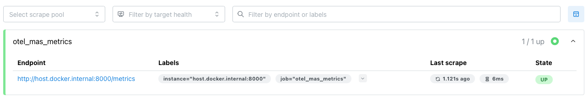
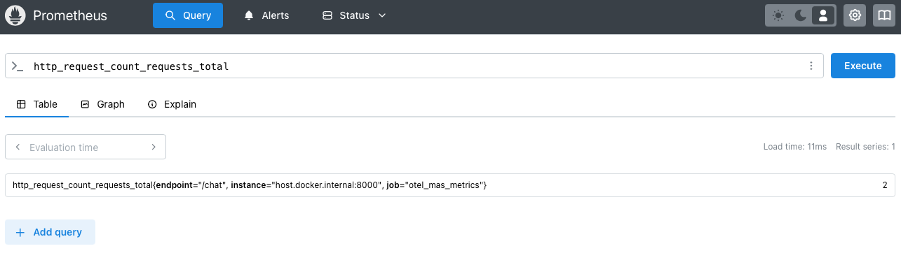

# Multi Agent System Demo

## Introduction
This project is my effort to demonstrate a **Agentic AI** using **Microsoft AutoGen** for AI-driven intelligence. 
In this project you will learn

1. Create autonomous agents using LLMs and functions
2. Integrate with custom llm models
3. Leverage APIs and LLMs as tools
4. Create multi agent systems
5. Expose multi agent systems as REST APIs

As part of this project you will also learn

1. A clean python project structure
2. Leveraging Python OOP and structural programming paradigms.
3. Why use FAST API?

## Project Structure
```
multi_agent_system_demo/
│── mas_autogen/
|   |__ app                 
|   |   │── agents/                 
|   |   │── functions/                  
|   |   │── services/               
|   |   │── utils/                  
|   │── server.py                   
|__ pyproject.toml                    
│── README.md                     
```

## Setup Instructions
**Pre-requisites** - Install Poetry on you machine - https://python-poetry.org/docs/

#### 1. Clone the github repo

#### 2. Install Poetry & Dependencies
```
poetry install
```

#### 3. Activate Virtual Environment
```
poetry shell
```

#### 4. Run FastAPI Server
```
cd mas_autogen/app && python server.py
```

#### 5. Test your application

1. Pre-requisite: **REST Client** extension for visual studio code.
2. Open [requests.http](/requests.http)
3. Click of **Send Request** on any of the available sample requests

## API Endpoints
| Method | Endpoint         | Description              |
|--------|------------------|--------------------------|
| `GET`  | `/health-check`  | Health check for the API |
| `GET`  | `/chat   `       | Get response from agents |

## BTP Deployment

#### 1. Build project
```
mbt build
```

#### 2. Deploy project
```
cf deploy mta_archives/multi_agent_system_demo_1.0.0.mtar
```

## OOPs concepts 

| OOP Concept       | Usage         |
|-------------------|---------------|
| **Abstraction**   | `SuperAgent` defines a structure and hides implementation details using `@abstractmethod`. |
| **Inheritance**   | `WeatherAgent` extends `SuperAgent`, inheriting its common logic like `start_chat()`. |
| **Encapsulation** | Each agent’s internal behavior is hidden from the caller |
| **Polymorphism**  | `start_chat()` is generic and works with different agents that implement `create_ai_agents()`. |


## Why use FastAPI

| Feature                    | FastAPI                       | Flask                  |
|----------------------------|-------------------------------|------------------------|
| **Performance**            | ✅ Faster (ASGI-based)        | ❌ Slower (WSGI-based) |
| **Async Support**          | ✅ Built-in `async/await`     | ❌ Requires workarounds|                  
| **Auto Docs**              | ✅ Swagger & Redoc by default | ❌ Needs third-party  tools                        |
| **WebSockets**             | ✅ Fully supported            | ❌ Limited support     |
| **Data Validation**        | ✅ Automatic with Pydantic    | ❌ Manual validation required                     |
| **Production Ready**       | ✅ Scales well with Uvicorn & Gunicorn | ✅ Stable but synchronous                  |


## Formatting & Linting VS code plugins
- **Black** is used for auto-formatting.
- **Pylint** is configured for linting.
- **Rest Client** is configured for API testing.

## Agent Evaluation
1. Lets evaluate agents with the help of open telemetry.
2. Import below libraries
    ```
    poetry add opentelemetry-sdk
    poetry add opentelemetry-api
    ```
3. The above libraries provide below features 
    - opentelemetry-api → API interface for traces and metrics.
    - opentelemetry-sdk → SDK for collecting and processing data.
    - opentelemetry-exporter-prometheus → Exporter to view metrics locally.   

4. Created a observability class - [agent_observability.py](/mas_autogen/app/utils/agent_observability.py). In this class, I have created two methods, one for tracing the API endpoints and other for tracing 
agent functions.

5. Add decorator on the api endpoint in [agent_service.py](/mas_autogen/app/services/agent_service.py)
    ```
    @router.post("/chat")
    @agent_observability.metric_decorator(endpoint="/chat")
    async def chat(request: ChatRequest):
    ...
    ...
    ```

6. Add decorator to the agent function in weather_functions.py. 
    ```
    @agent_observability_mas.trace_agent_function(function_name="get_weather_data")
    def get_weather_data(zip_code: str) -> dict:
    """This function calls weather api to get the data.
    ...
    ...
    ```
    The decorator implementation is in the [agent_observability.py](/mas_autogen/app/utils/agent_observability.py) 
    The observability utility methods can be applied as decorators on the application code.

7. Observe the logs carefully:
    - You should see the custom attribute - **response_time_ms** captured in the **resource_metrics**
    - You should also see logs of spans captured in the **resource_spans**

8. In this tutorial I am relying on docker image. 
    - **Pre-requisite:** Install  docker   desktop on your machine.
    - Create docker network as we are going to install quite a observability tools which are integrating with each other.
    ```
    docker network create docker-otel-network
    ```

8. Next is to push this metrics to Prometheus. Prometheus is a **Time-Series-Based** data store ideal for metric collection and storage.
    - Install prometheus library
        ```
        poetry add opentelemetry-exporter-prometheus
        ```

    - Create a file [prometheus.yml](/observability/prometheus.yml)
    - Open Docker desktop terminal and go to the folder
        ```
        cd /<your path>/PythonProjects/multi_agent_system_demo
        ```
    - Run the below docker command
        ```
        docker run -d --name prometheus --network docker-otel-network -p 9090:9090 \
        -v $(pwd)/observability/prometheus.yml:/etc/prometheus/prometheus.yml \
        prom/prometheus
        ```
        The above command will install docker image with the configuration in prometheus.yml

    - Open Prometheus dashboard, it should be up and running [http://localhost:9090/query](http://localhost:9090/query)
    - Open Prometheus target page - [http://localhost:9090/targets](http://localhost:9090/targets) and you should see the job as shown in the below diagram
    
    - Execute a request and then go to [http://localhost:9090/query](http://localhost:9090/query). Query **http_request_count_requests_total** and you 
    should see data as shown in below image
    

8. Till now in above step we have stored the metrics in Prometheus.

9. Let us now store the traces in **Grafana Tempo**. It is a efficient trace storage.
    - Create a file [tempo.yml](/observability/tempo.yml).
    - Open Docker desktop terminal and go to the folder
    ```
    cd /<your path>/PythonProjects/multi_agent_system_demo
    ```
    - Run the below docker command
    ```
    docker run -d --name tempo --network docker-otel-network -p 5317:4317 -p 5318:4318 \
    -v $(pwd)/observability/tempo.yml:/etc/tempo/tempo.yml \
    grafana/tempo:latest --config.file=/etc/tempo/tempo.yml
    ```
    Port 4317: OTLP gRPC endpoint - Default OpenTelemetry exporters(OTLPSpanExporter) use gRPC
    Port 4318: OTLP HTTP endpoint - Some tracing agents might not support gRPC and might use HTTP.

    - Create file - [otel-collector-config.yml](/observability/otel-collector-config.yml)
    - Install OpenTelemetry Collector image
    ```
    docker run -d --name otel-collector --network docker-otel-network -p 4327:4317 -p 4328:4318 \
    -v $(pwd)/observability/otel-collector-config.yml:/etc/otel-collector-config.yml \
    otel/opentelemetry-collector-contrib --config /etc/otel-collector-config.yml
    ```
    Collector now listens on 4327 and forwards it to 4317

    - Add below code fragment in the **init_observability** method
    ```
    # Export traces to Grafana Tempo
        otlp_exporter = OTLPSpanExporter(
            endpoint="http://localhost:4327", insecure=True
        )  # TBD: Remove insecure=True for production. 
        self.tracer_provider.add_span_processor(BatchSpanProcessor(otlp_exporter))
    ```
    The above code fragment will export the traces and push it in batches to Grafana Tempo

10. Now, we have metrics in **Prometheus** and traces/spans in **Grafana Tempo**. Let us try to 
    visualize both in a common visualization tool - **Grafanna**
    - Download grafana
    ```
    docker pull grafana/grafana:latest          
    ```
    - Run grafana
    ```
    docker run -d --name grafana --network docker-otel-network -p 3000:3000 grafana/grafana
    ```
    - Open Grafana dashboard and set your password
    - Add datasource tempo with url
    ```
    http://tempo:3200
    ```
    - Add datasource for prometheus
    ```
    http://host.docker.internal:9090
    ```

11. Explore the **Grafana** dashboard. 
    - Grafana metric dashboard 
    

    - Grafana trace dashboard
    

12. Observability - Block Diagram

    ```mermaid
    graph TD;
    A[Python App] -->|Generates Logs & Metrics| B[OpenTelemetry SDK];
    B -->|Sends Metrics| C[Prometheus: Metric Store];
    B -->|Sends Traces via OTLP| D[OpenTelemetry Collector];
    D -->|Forwards Traces| E[Tempo: Trace Store];
    C <--> |Queries Metrics| F[Grafana Dashboard];
    E <--> |Queries Traces| F[Grafana Dashboard];
    
    subgraph Observability Stack
        C
        E
        F
    end
    ```

## References
1. https://microsoft.github.io/autogen/0.2/docs/tutorial/introduction
2. https://microsoft.github.io/autogen/0.2/blog/2024/01/26/Custom-Models
3. https://github.com/microsoft/autogen/issues/2929
4. https://grafana.com/blog/2021/05/04/get-started-with-distributed-tracing-and-grafana-tempo-using-foobar-a-demo-written-in-python/


